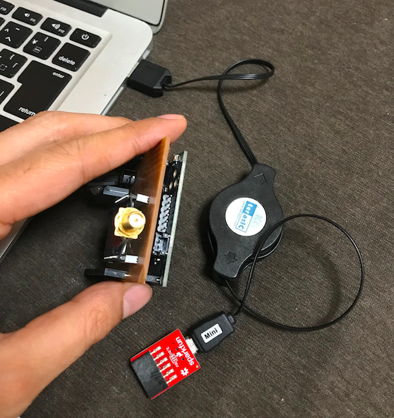
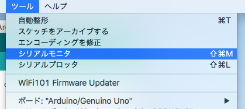
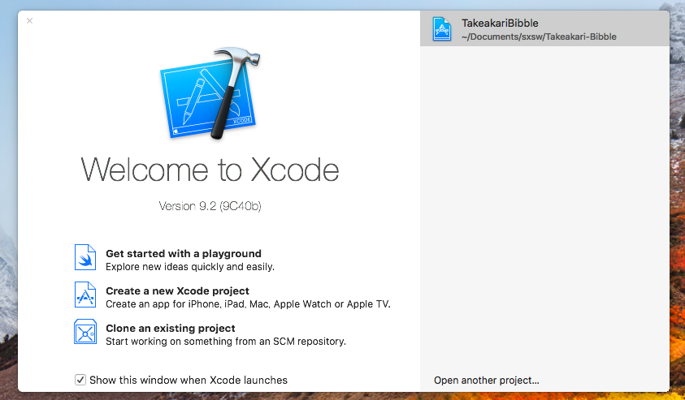

# はじめに
このドキュメントは SXSW での竹あかり展示に用いる明かりモジュールの設定と操作について説明したものです。

2018/03/02
Shinobu Izumi (stagesp1@gmail.com)

# Macのログイン
アカウント：SXSW （管理者）

パスワード：sxsw

# 1. ハードウェア設定

## Arduinoの設定
Arduinoモジュールには明かり制御のためのプログラムが書き込み済み。
明かりを制御するグループごとにIDを割り振る必要がある。

事前の予定に基づいてIDを割り振っていますが、現場での個数の変更や故障などがあった場合は、適宜IDを振り直してください。

### Arduinoの接続




シリアルケーブルを接続します。


逆には刺さらないのでご安心。

### 明かりモジュールへのXBeeの接続


明かりモジュールにXBeeを接続する。

足が曲がりやすいので、なるべくまっすぐに上からさせるように気をつけて作業すること。


XBeeは写真の向きとおなじになるように。
（逆に挿してもすぐに故障はしません）

次のArduinoの設定はXBeeを付けたままで行えます。

### Arduino IDEを用いた設定


Arudion IDEを起動する


メニューのツールからボード Arduino/Genuino Uno を選択する


メニューのツールからシリアルポートを選択する
/dev/cu.usbserial-XXXXXXXXX



メニューのツールからシリアルモニタを選択する


右下の通信速度を 57600 bps にする

```
-- setup start --
please input ID. within 5000 ms.
```

が表示されてから５秒間がID設定モードとなる。
ここで、上部の入力ボックスに数字を入力して送信（エンター）すると、それがIDとして設定される。

５秒間に入力できなかった場合や間違えた場合は、シリアルモニタを閉じてメニューから再度開く。


５秒が経過すると、現在のIDが表示される。

### IDについて
明かりモジュールのIDごとに、明かりの色を制御するデータが送られるため、同一のIDを持つモジュールは同様の色変化をする。
複数のモジュールに共通のIDを設定することで、それらを同期的に色変化させられる。

## XBeeの設定
設定済みのため基本的には行わなくて大丈夫です。

### コンピュータに接続


XBeeのアダプタをUSBで接続し、アダプタにXBeeを付けます。


電波の飛距離を出すためにアンテナを接続します。

### XCTUを用いた設定


XCTUを起動する


右上の虫眼鏡アイコンをクリック


usbserial-XXXXXXXXX のような名前のものをチェックして Next


探す対象のXBeeの設定を選んで Finish
（通常は画像の設定で大丈夫です）


見つかったものを選択して Add selected devices


追加されたものを選択するとXBeeモジュールの設定内容が表示される

CHがC、IDが3332、DHが0、DLがFFFF、BDが19200、APがAPI disabled[0]であることを確認する。異なっている場合は設定して右側の鉛筆ボタンで書き込み。

（注）XBeeが通信を受信していると読み出しや書き込みが上手くできない事があるので、設定するときは送信しているXBeeを止めてから行うと良い。マイクなどの電波と干渉することもあるが、その場合は場所を変えるなどで頑張る。


設定中にXBeeが抜けるなどでXBeeの状態が不正になった場合は読み出し、書き込みができなくなる。その場合は、上部のスパナアイコンからXBee Recoveryを選択。


図のように選択し、Recoverをクリックすると大体復活する。
Firmwareは最新ではなく10edであることに注意。

### チャンネルについて
CH - チャンネル
これと、IDが同じXBeeは通信することができる。送出と受信両方のXBeeを同じチャネルとIDに設定すること。

通信速度の関係で、１つのチャネルで最大１３グループの明かりモジュールを制御できる。１３グループを超える場合は送出のXBeeを増やし、チャンネルを分ける。

## 電池の接続と電源


電池をコネクタに接続します。ケーブル部分を引っ張らないように気をつけて付け外ししてください。


電池接続時は、側面のスイッチをExtにするとOff、BattにするとOnになる。電源投入５秒後にモジュールが一度光る。強い光が出て眩しいため、ティッシュペーパーを上に載せる、手で遮るなどすると良い。

# 2. プログラムの起動と操作

今回は３つのプログラムを、それぞれ開発環境から起動する。

#### プログラムA. Bibbleと接続してボタン操作などを受け取る
XCodeから起動する。
プログラムCと接続してボタン操作などを中継する。

#### プログラムB. XBeeと接続して色制御情報を送出する
Eclipseから起動する。
プログラムCから接続され色情報を送出する。

#### プログラムC. 色の変化を制御する
Unityから起動する。プログラムAからの情報を受け取りプログラムBに送り出す。
UIを用いて色の変化をテストする。

次に、それぞれの起動と使い方を説明する。どのプログラムも不具合を感じたら、終了、または、強制終了して問題ない。

基本的にどの順番で起動しても問題ないはずだが、以下の手順（A→B→C）で起動することを推奨する。

## プログラムA


XCodeを起動する。



TakeakariBibbleを選択（ダブルクリック）


左上の再生ボタンをクリックするとビルドと実行が行われる。


上のようなアプリが起動し、近くにあるBibbleを見つけてリスト表示する。

リストから接続したいBibbleの行をクリックすると、選択したBibbleのボタン操作、距離情報をプログラムBに送出し始める。
（プログラムBは後で起動して良い）


選択したものは名前左に (o) が付加される。数秒程度かかる場合が多いので、焦らず待つ。


接続したBibbleのボタンを操作すると、短いクリック、長いクリックそれぞれが行われた時間が行に表示される。

## プログラムB

これ以降は、XBeeをPCにUSB接続した状態で行うこと。
（後でUSB接続しても大きな問題はない）


Eclipseを起動する。


プロジェクトが開いた状態で起動する。


右上の緑の再生ボタンをクリックするとプログラムが起動する。
（無視マークの右側）


上部入力ボックスに入力されているのがPCがXBeeと通信をするために用いるシリアルポートである。接続するアダプタによって異なるため、場合によっては書き換える必要がある。

シリアルポートの調べ方は後に記述する。

Start Serverボタン（中央部全体どこでも）をクリックすると、プログラムCからの接続を待ち受けるサーバが起動する。

表示がStop Serverになっているはずなので、もう一度押すとサーバが停止する。


操作を受け付けないなどの状態になったときは、Eclipse右下の赤い停止ボタンで強制停止できる。

### シリアルポートの調べ方

XBeeをUSB接続した状態で行うこと。


ターミナルを開く


ls /dev/tty.usb と入力してキーボードのTabを押す。


残り部分が保管されポートがわかる。

## プログラムC


Unityを起動する。


Takeakari-Systemを選択する。


Unityが起動したら上部の再生ボタンをクリックする。


中央の画面が全体に拡大され実行状態になる。

### Bibbleデータの受信確認

左側のBibbleアイコンをクリックする


画面下部に表示されたウィンドウの Listen をチェックする
（これでプログラムAからの接続とデータを受け入れる状態になる）


暫く待つと、Biblleの情報が表示される

左からBibbleのUID, 概算距離、ボタン操作

ここで、２行以上表示されている場合は、プログラムAにおいて、Bibbleが複数選択されているとかんがえられるので、Listenをチェックを外して停止、プログラムAを停止して再度操作、Listenを再度チェックとすると良い。


Bibbleを操作して右のボタン状態表示が変化することを確認する。短いボタン操作は 1@時刻、長いボタン操作は 2@時刻 と表示される。

### 色変化の確認

左側のコントロールパネルアイコンをクリックする


右側にコントロールが表示され、画面中央の色変化が始まる。


ここで再度Bibbleのボタン操作を行うと、明かりが変化する。


右側の白地部分で現在のモードがわかる。短いクリックでモードが順番に変化。長いクリックをするとRandom Autoモードになる。

クリック操作を１００％受け取れるわけではないので、変化が無いときは数回クリックするなどしてください。

### プログラムBとの接続


右上の Connect To ServerをクリックするとプログラムBに接続し、色情報の送出が始まる。
（明かりモジュールの電源が入っていれば、明かりが変化する）

画面中央部の明かりそばに表示されている数字は明かりモジュールのIDである。


テストシーケンスを実行すると、モジュールIDの順に明かりが点灯するので確認すると良い。


コントロールパネルの緑枠部分 Speed は、色の変化速度を制御する。Lightは現状では操作しても何も効果はない。

## 各ソフトウェアの停止
AはXCode上の再生ボタン右の停止ボタン、Bは通常の左上の閉じるボタン、Cは再生ボタンをもう一度クリック（青から灰色に変化）

各開発ツールは起動しっぱなしでMacの画面を閉じて問題ありません。

## あとがき
複雑なので、１つづつ動いていることを確認しながらすすめるのが成功のコツです。
